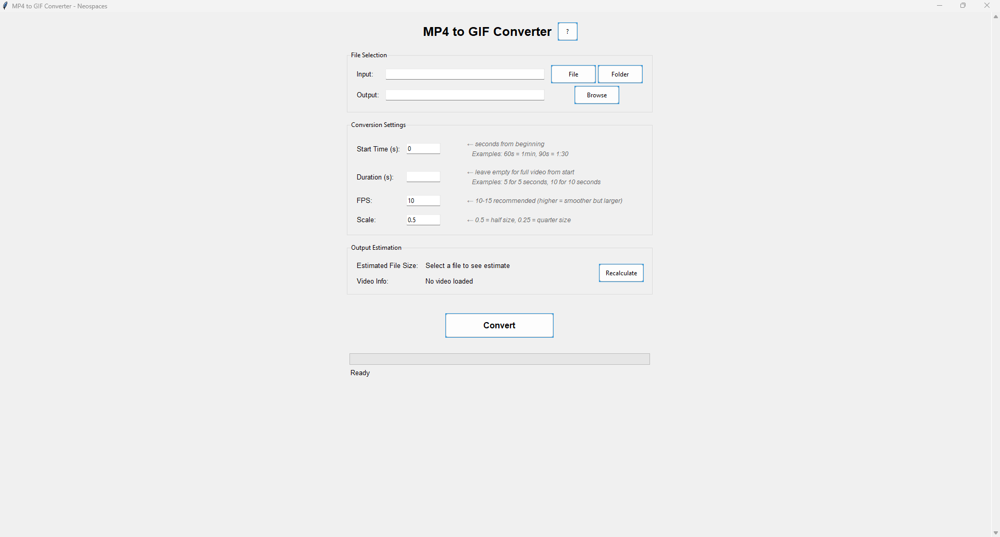

# Enhanced MP4 to GIF Converter

## Description

Enhanced MP4 to GIF Converter is a user-friendly desktop application that allows you to convert MP4 video files to GIF format. Built with Python and Tkinter, this tool provides a graphical interface for easy conversion of single files or batch processing of multiple files, with helpful guidance for all settings.



## Features

- Convert single MP4 files to GIF
- Batch convert multiple MP4 files in a folder
- Customize conversion parameters with clear explanations:
  - Start time in seconds
  - Duration in seconds
  - Frame rate (FPS)
  - Output scale
- Helpful tooltips for each setting
- Example values and formatting guides
- Comprehensive help documentation
- File size estimation
- Video information display
- User-friendly graphical interface
- Progress bar for conversion tracking

## Requirements

- Python 3.x
- tkinter
- moviepy
- numpy
- Pillow (PIL)

## Installation

1. Ensure you have Python 3.x installed on your system.
2. Install the required dependencies:

```
pip install moviepy numpy Pillow
```

3. Download the `mp4_to_gif_converter.py` file.

## Usage

1. Run the script:

```
python mp4_to_gif_converter.py
```

2. The application window will open.

3. For single file conversion:
   - Click "File" to select an MP4 file
   - Choose an output location and filename
   - Set conversion parameters (explained below)
   - Click "Convert"

4. For batch conversion:
   - Click "Folder" to select a folder containing MP4 files
   - Choose an output folder
   - Set conversion parameters (explained below)
   - Click "Convert"

5. Monitor the progress bar for conversion status.

## Understanding Time Inputs

### Start Time
- Enter the time in seconds from the beginning of the video where the GIF should start
- For example:
  - `0` = Start from the beginning
  - `30` = Start 30 seconds into the video
  - `60` = Start 1 minute into the video
  - `90` = Start 1 minute and 30 seconds into the video

### Duration
- Enter how long (in seconds) the GIF should be
- Leave empty to use the entire video from the start time
- For example:
  - `5` = 5-second GIF
  - `10` = 10-second GIF

## Other Parameters

### FPS (Frames Per Second)
- Controls the smoothness of the animation and affects file size
- Recommended values:
  - `10` = Good balance between quality and file size (default)
  - `15` = Smoother animation but larger file
  - `20` = Very smooth but much larger file

### Scale
- Resizes the output GIF relative to the original video
- Values between 0 and 1:
  - `0.5` = Half the original size (default)
  - `0.25` = Quarter of the original size
  - `1.0` = Original size (will create a large file)

## File Size Considerations

The application provides an estimated file size based on your settings. Several factors affect GIF file size:

- **Duration**: Longer GIFs = larger files
- **FPS**: Higher frame rates = larger files
- **Scale**: Larger dimensions = larger files
- **Content**: Complex scenes with lots of motion = larger files

### Tips for smaller files:
- Use lower FPS (8-10 is often sufficient)
- Reduce the scale (0.3-0.5 is usually good)
- Keep the duration short (under 10 seconds if possible)
- Choose scenes with less movement

## Notes

- The application uses a custom resize function to maintain better quality in the output GIF.
- Error handling is implemented to manage conversion issues and provide user feedback.
- The file size estimation is approximate and actual results may vary.

## License

MIT

## Author

Ricky Segura

## Acknowledgments

This project uses the following open-source libraries:
- moviepy
- numpy
- Pillow (PIL)

Special thanks to the Neospaces team for inspiration and support.